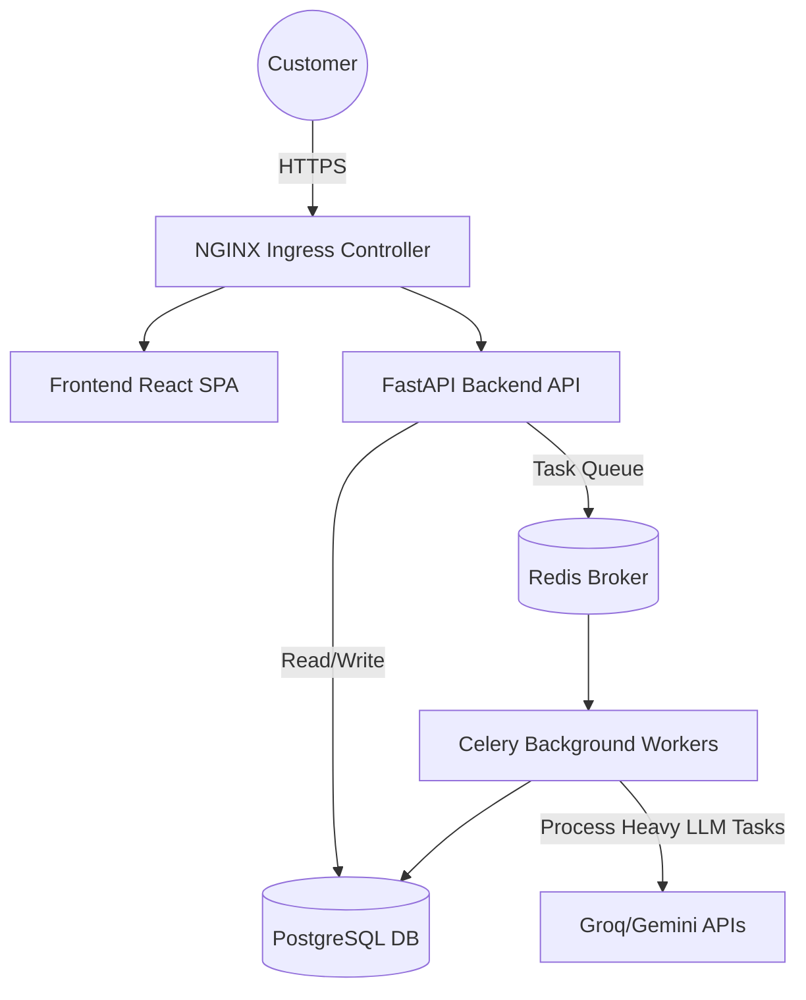

<div align="center">

<pre>
   _____ _     _       _   _         _____ _    _        _____ _        _            _     
  / ____| |   (_)     | | | |       |_   _| |  | |      / ____| |      | |          | |    
 | (___ | |__  _ _ __ | |_| |__  _   _| | | |__| |_____| (___ | |_ __ _| |_ ___  ___| |__  
  \___ \| '_ \| | '_ \| __| '_ \| | | | | |  __  |______\___ \| __/ _` | __/ _ \/ __| '_ \ 
  ____) | | | | | |_) | |_| | | | |_| |_| | |  | |      ____) | || (_| | ||  __/\__ \ | | |
 |_____/|_| |_|_| .__/ \__|_| |_|\__, |_____|_|  |_|     |_____/ \__\__,_|\__\___||___/_| |_|
                | |               __/ |                                                    
                |_|              |___/                                                     
</pre>

<h3>AI-Powered Enterprise Customer Support for Shipping</h3>
<p><strong>Production-Grade | Microservices | Kubernetes EKS | GitOps | Terraform</strong></p>

<p>
  
  
  
  
  
</p>

<p>
  <a href="#english">English</a> • <a href="#arabic">العربية</a>
</p>

</div>

---

<a name="english"></a>
# English Documentation

## Executive Summary

**Shiphny AI Support Agent** has evolved into a fully-fledged enterprise microservices architecture. Designed for Egyptian shipping companies, the system handles real-time multilingual conversations (Arabic/English) with an uncompromising focus on data security, zero-downtime deployments, and highly scalable infrastructure.

This repository houses the entire Monorepo, including Backend, Frontend, Infrastructure as Code (IaC), and Kubernetes Manifests.

---

## Technical Architecture & Infrastructure

We have migrated from traditional PaaS (Render/Vercel) to a robust **Enterprise Grade Infrastructure on AWS**.

### System Design (Microservices)



### CI/CD & GitOps Pipeline

We implement a state-of-the-art **Push-to-Deploy GitOps Pipeline**.

1. **Continuous Integration (GitHub Actions):**
   - Developer pushes code to `main`.
   - GitHub Actions checks out the code, configures AWS credentials securely.
   - Builds optimized, multi-stage Docker images for `backend` and `frontend`.
   - Tags and pushes the images to **AWS ECR (Elastic Container Registry)**.
   - Automatically updates the `values.yaml` in the Helm chart with the new image tags.

2. **Continuous Deployment (ArgoCD):**
   - **ArgoCD** runs inside the AWS EKS cluster.
   - It continuously monitors this Git repository.
   - Upon detecting the updated `values.yaml`, ArgoCD automatically syncs and deploys the new images to the Kubernetes cluster without zero downtime using Rolling Updates.

### Infrastructure as Code (Terraform)

All AWS infrastructure is managed declaratively via Terraform (`/infrastructure`):
- **VPC & Networking:** Custom VPC with Public/Private subnets, NAT Gateways, and strict security groups.
- **EKS Cluster (v1.30):** Managed Kubernetes cluster with auto-scaling Node Groups (`t3.large` instances).
- **ECR Repositories:** Secure private container registries for storing microservice images.
- **Remote State:** S3 Backend with DynamoDB state locking for team collaboration.

---

## Security Implementation

### 5-Layer AI Defense System
1. **Global Injection Guard:** Sanitizes system override keywords.
2. **Injection Marker Blocker:** Rejects malicious user patterns.
3. **Deterministic Response Builder:** Identity verification is hardcoded in the backend — AI *never* decides to reveal PII.
4. **AI System Prompt Rules:** Explicit restrictions against self-verification.
5. **System-Only Trust:** Verification tags are only trusted if generated by the system.

*(Security Test Coverage: 24/24 Penetration Tests Passing)*

---

## Technology Stack

| Domain | Technology | Purpose |
|--------|------------|---------|
| **Cloud Provider** | AWS (Amazon Web Services) | Enterprise hosting & scalability |
| **Infrastructure** | Terraform | Infrastructure as Code (IaC) |
| **Orchestration** | Kubernetes (EKS), Helm | Container orchestration & templating |
| **CI/CD** | GitHub Actions, ArgoCD | GitOps automated deployments |
| **Backend** | FastAPI, Celery, Python 3.11 | High-performance Async API |
| **Database/Cache** | PostgreSQL, Redis | Persistent storage & Message brokering |
| **Frontend** | React 18, TypeScript, Tailwind | Modern, responsive user interface |

---

## Local Development (Docker Compose)

You can spin up the entire microservices stack locally with one command:

```bash
docker-compose up --build
```
*This will launch the Database, Redis, Celery Worker, Backend (Port 8000), and Frontend (Port 5173).*

---

<div align="center">
  <b><a href="#english">Back to Top</a></b>
</div>

---

<a name="arabic"></a>
<div dir="rtl" align="right">

# التوثيق العربي

## ملخص تنفيذي

تطور **نظام شحني للدعم الفني بالذكاء الاصطناعي** ليصبح بنية مؤسسية متكاملة للخدمات المصغرة (Microservices). تم تصميم النظام لشركات الشحن المصرية، حيث يتعامل مع المحادثات الفورية متعددة اللغات مع تركيز لا هوادة فيه على أمن البيانات، وتحديثات النظام بدون انقطاع (Zero-Downtime)، وبنية تحتية عالية التوسع.

يحتوي هذا المستودع (Monorepo) على كل ما يخص المشروع: الواجهة الأمامية، الخلفية، البنية التحتية ككود (Terraform)، وملفات الكوبرنيتز (Helm Charts).

---

## البنية التحتية والتقنية

لقد انتقلنا من الاستضافات التقليدية إلى **بنية تحتية بمستوى المؤسسات الكبرى على سحابة AWS**.

### تصميم النظام (الخدمات المصغرة)

- يتم استقبال طلبات العميل عبر **NGINX Ingress Controller**.
- يتم توجيه الطلبات إما إلى **الواجهة الأمامية (React)** أو **واجهة برمجة التطبيقات (FastAPI)**.
- تعتمد الخلفية على قاعدة بيانات **PostgreSQL** لحفظ البيانات بشكل آمن.
- لضمان سرعة الرد وعدم تعليق الخادم، يتم إرسال مهام الذكاء الاصطناعي الثقيلة إلى **Redis** ليقوم الـ **Celery Worker** بمعالجتها في الخلفية.

### خط أنابيب النشر المستمر (CI/CD & GitOps)

نحن نطبق أحدث معايير الـ **GitOps** للنشر التلقائي:

1. **التكامل المستمر (GitHub Actions):**
   - بمجرد رفع أي كود جديد إلى `main`، يبدأ الـ Pipeline بالعمل.
   - يقوم ببناء صور (Docker Images) مُحسّنة وخفيفة جداً.
   - يرفع الصور إلى خزنة **AWS ECR** الخاصة بنا بشكل آمن.
   - يقوم بتحديث ملفات الـ Helm Chart تلقائياً بالنسخ الجديدة.

2. **النشر المستمر (ArgoCD):**
   - يعمل **ArgoCD** كـ "مراقب" داخل سيرفرات Kubernetes.
   - بمجرد أن يلاحظ تحديثاً في الكود على GitHub، يقوم بسحب الصور الجديدة ونشرها على السيرفرات تدريجياً (Rolling Update) بحيث لا يلاحظ العميل أي انقطاع في الخدمة!

### البنية التحتية ككود (Terraform)

تتم إدارة جميع موارد AWS بالكامل برمجياً عبر Terraform:
- **الشبكات (VPC):** شبكات خاصة وعامة مع بوابات حماية صارمة.
- **مجموعة الخوادم (EKS):** سيرفرات Kubernetes مُدارة آلياً (نسخة 1.30) مع خاصية التوسع التلقائي لتتحمل أي ضغط.
- **التخزين المؤمّن:** حفظ حالة البنية التحتية على AWS S3 مع قفل التعديلات المشتركة عبر DynamoDB.

---

## الأمان والحماية

يحتوي النظام على 5 طبقات دفاعية تضمن عدم قيام الذكاء الاصطناعي بتسريب بيانات الشحنات الخاصة للعملاء إطلاقاً (تم اجتياز 24 اختبار اختراق بنجاح تام).

---

## مكدس التقنيات (Tech Stack)

| المجال | التقنية | الغرض |
|--------|---------|--------|
| **السحابة** | AWS | استضافة مؤسسية قابلة للتوسع |
| **البنية التحتية** | Terraform | برمجة وأتمتة البنية التحتية |
| **التوزيع** | Kubernetes, Helm | إدارة الحاويات وضمان استقرارها |
| **CI/CD** | GitHub Actions, ArgoCD | أتمتة النشر عبر منهجية GitOps |
| **الخلفية** | FastAPI, Celery, Python | واجهة برمجية فائقة السرعة |
| **قواعد البيانات** | PostgreSQL, Redis | حفظ البيانات وإدارة طوابير المهام |
| **الواجهة الأمامية** | React 18, TypeScript | واجهة مستخدم عصرية وسريعة |

---

## التطوير المحلي

يمكنك تشغيل بيئة المشروع بالكامل على جهازك بأمر واحد فقط:

```bash
docker-compose up --build
```
*سيقوم هذا الأمر بتشغيل: قاعدة البيانات، Redis، عمال Celery، واجهة الـ API، والواجهة الأمامية للمستخدم دفعة واحدة.*

---

<div align="center">
  <b><a href="#arabic">العودة إلى الأعلى</a></b>
</div>

</div>
