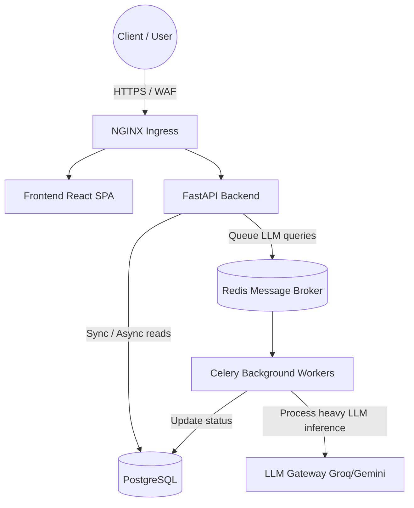

<div align="center">

<pre>
   _____ _     _       _   _         _____ _    _        _____ _        _            _     
  / ____| |   (_)     | | | |       |_   _| |  | |      / ____| |      | |          | |    
 | (___ | |__  _ _ __ | |_| |__  _   _| | | |__| |_____| (___ | |_ __ _| |_ ___  ___| |__  
  \___ \| '_ \| | '_ \| __| '_ \| | | | | |  __  |______\___ \| __/ _` | __/ _ \/ __| '_ \ 
  ____) | | | | | |_) | |_| | | | |_| |_| | |  | |      ____) | || (_| | ||  __/\__ \ | | |
 |_____/|_| |_|_| .__/ \__|_| |_|\__, |_____|_|  |_|     |_____/ \__\__,_|\__\___||___/_| |_|
                | |               __/ |                                                    
                |_|              |___/                                                     
</pre>

<h3>Next-Generation AI Support & Enterprise Logistics Platform</h3>

<p>
  <strong>Production-Ready Microservices • Kubernetes (AWS EKS) • GitOps • Terraform</strong>
</p>

<p>
  
  
  
  
  
</p>

</div>

---

## 🎯 Executive Summary

**Shiphny** is a modern, enterprise-grade logistics and AI support platform built to handle real-world scale. Designed with a clear separation of concerns, it seamlessly blends a powerful microservices backend with an intelligent LLM-driven customer support agent. 

Built from the ground up for high availability, zero-downtime deployments, and strict data security, Shiphny is engineered not just to work, but to scale reliably under enterprise workloads.

---

## 🏗 System Architecture

We employ a robust, loosely-coupled microservices architecture designed to prevent bottlenecks and ensure horizontal scalability.



### Why this architecture?
- **Asynchronous AI Processing:** LLM inference is fundamentally slow and prone to rate limits. By offloading AI queries to **Celery + Redis**, the main FastAPI event loop remains unblocked, ensuring blazing-fast API response times even under heavy concurrent load.
- **Stateless Services:** Both the FastAPI backend and Celery workers are completely stateless, meaning they can be scaled up or down instantly based on CPU/Memory metrics.
- **Resiliency:** If an LLM provider goes down, Celery automatically retries without dropping customer requests.

---

## 🔒 The 5-Layer AI Defense System

Exposing LLMs to public users carries inherent risks (e.g., prompt injection, PII leakage). We've engineered a rigorous defense-in-depth security model:

1. **Global Injection Guard:** Sanitizes system override keywords before they ever reach the model.
2. **Deterministic Response Builder:** Core identity verification (auth) is hardcoded securely in the backend. The AI *never* decides on its own if a user is authenticated.
3. **Injection Marker Blocker:** Rejects known malicious user patterns dynamically.
4. **Strict System Prompt Sandboxing:** Explicit constraints preventing the model from outputting anything outside its allowed domain knowledge.
5. **System-Only Trust Verification:** Verification tags are only trusted if cryptographically generated by the backend system.

---

## 🚀 DevOps, CI/CD & GitOps

We have moved past traditional CI/CD. Shiphny utilizes a state-of-the-art **Push-to-Deploy GitOps Pipeline**.

1. **Continuous Integration (GitHub Actions):**
   - On every push to `main`, GitHub Actions runs unit tests, linting, and builds multi-stage, highly optimized Docker images.
   - Images are tagged with the Git SHA and pushed securely to **GitHub Container Registry (GHCR)**.
   - The pipeline automatically updates the `values.yaml` in our Helm chart.

2. **Continuous Deployment (ArgoCD):**
   - **ArgoCD**, running inside the Kubernetes cluster, detects the drift in the Git repository.
   - It automatically syncs the cluster state to match the repository, performing **Rolling Updates** to ensure zero downtime.

3. **Infrastructure as Code (Terraform):**
   - All AWS infrastructure is managed declaratively via `/infrastructure`.
   - Provisions a custom VPC, NAT Gateways, EKS Cluster (managed node groups), and private container registries.
   - Uses S3 remote state with DynamoDB locking to ensure safe team collaboration.

---

## 🛠 Technology Stack

| Component | Technology | Why we chose it |
|-----------|------------|-----------------|
| **Frontend** | React 18, TypeScript, TailwindCSS, Framer Motion | Provides a highly responsive, type-safe, and visually stunning user experience. |
| **Backend API** | FastAPI, Python 3.11, SQLAlchemy, Pydantic | Offers native async support, automatic OpenAPI docs, and exceptional performance. |
| **Task Queue** | Celery, Redis | Decouples heavy AI inference from the main request-response cycle. |
| **Database** | PostgreSQL | ACID compliant, highly reliable, and horizontally scalable for enterprise data. |
| **Infrastructure** | AWS EKS, Terraform, Helm | Provides a predictable, declarative, and scalable cloud foundation. |
| **CI/CD** | GitHub Actions, ArgoCD | Enables true GitOps, ensuring the cluster always matches the source of truth. |

---

## 💻 Local Development

Get the entire microservices stack running on your machine in under a minute using Docker Compose.

```bash
# 1. Clone the repository
git clone https://github.com/your-org/shiphny-ai-support.git

# 2. Start the ecosystem
docker-compose up --build
```

**What happens?**
Docker Compose will orchestrate and launch:
- **PostgreSQL** Database (Port 5432)
- **Redis** Message Broker (Port 6379)
- **Backend API** (FastAPI) on `http://localhost:8000`
- **Frontend App** (React) on `http://localhost:3000`

---

## 📈 Scalability & Future Roadmap

- **Event-Driven Microservices:** Transitioning completely from REST to Kafka for core domain events (Shipment Created, Delivered, etc.).
- **Multi-Region Active-Active:** Expanding EKS clusters across multiple AWS availability zones for disaster recovery.
- **Advanced RAG Analytics:** Implementing vector databases to give the support AI deep historical context on enterprise B2B clients.

---

<div align="center">
  <i>Built with absolute focus on engineering excellence.</i>
</div>
